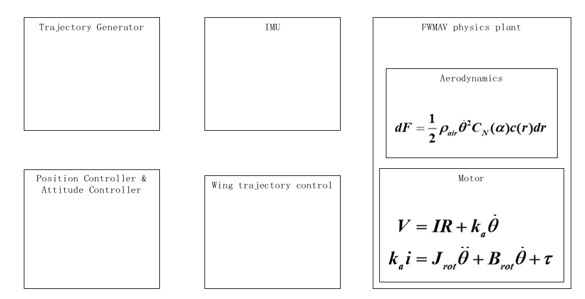

# QY-hummingbird

This is an open-source simulation platform for motor-driven FWMAV (Flapping Wing Micro Aerial Vehicles) developed by students from hitsz.

## The Grand Plan For QY-hummingbird

It sure is a fact that the design, fabrication and control of FWMAV have undergone extensive research and development, leading to the emergence of various designs and methods that showcase remarkable capabilities.

 

figure 1. the grand design for QY-hummingbird(V0) 

