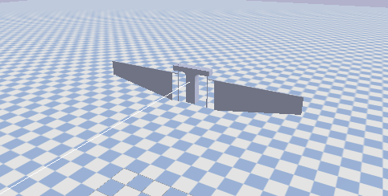
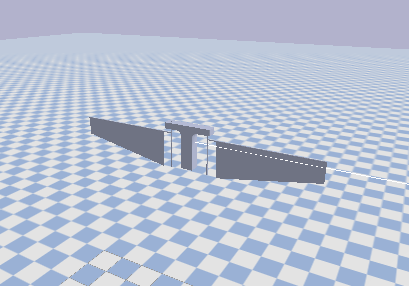
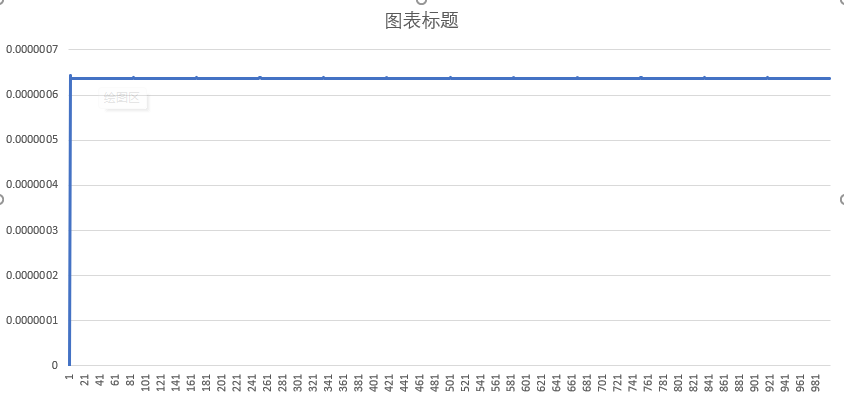
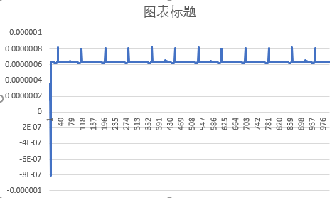

## QY-hummingbird

This is an open-source simulation platform for motor-driven FWMAV (Flapping Wing Micro Aerial Vehicles) developed by students from HITSZ(Harbin Institute of Technology, Shenzhen)

### The Grand Plan For QY-hummingbird

It sure is a fact that the design, fabrication and control of FWMAV have undergone extensive research and development, leading to the emergence of various designs and methods that showcase remarkable capabilities.

 

figure 1. the grand design for QY-hummingbird(V0) 

### TODO:

- 在仿真环境中需要加入噪声

### Specification

#### specification for constraint state 

data[0] -> force

data[1] -> force 

升力方向 为 data[2] 的反方向

torque 方向 和 力矩方向保持一致

（第一个周期的数据应该全部忽视）

#### what is the torque corresponding for returned by using the getJointState

1. 首先将 机翼的 旋转关节 以及 空气动力计算 全部关闭，此时按照 
   $$
   \tau = J \cdot \ddot{\theta}
   $$

计算得到的转动惯量非常一致 

2.将旋转关节打开，仍然不计算空气动力学，进行计算的转动惯量，会受stroke reversal 阶段的惯性力影响，有

-> 该得到的扭矩为
$$
\tau = J \ddot{\theta}+ B_{s1}\dot{\theta}
$$
目前正确的转动惯量为：6.37606E-7
